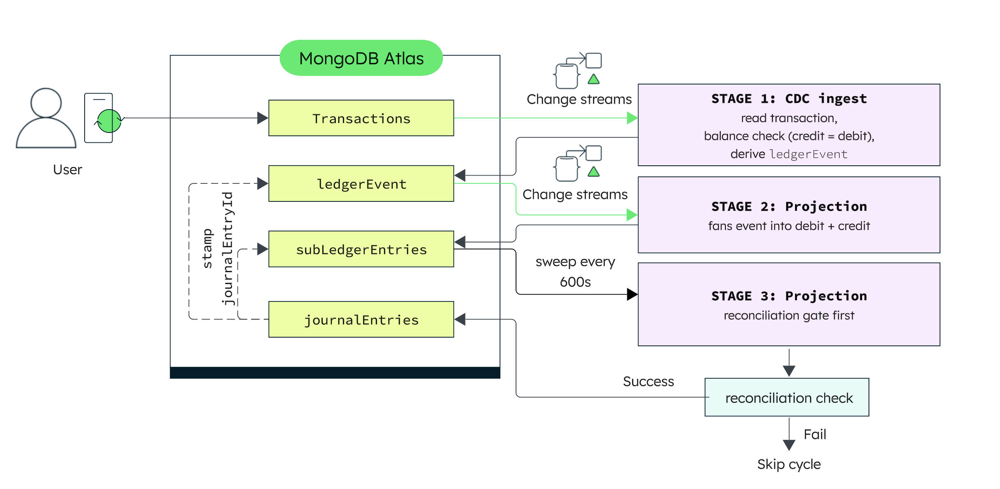
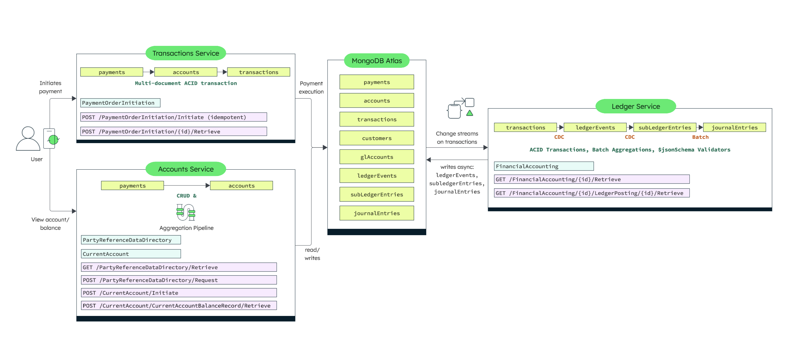

# Leafy Bank - Core Banking


**Leafy Bank is a BIAN v14-aligned core-banking reference**, showcasing the integration of MongoDB's powerful features tailored specifically for [Financial Services](https://www.mongodb.com/solutions/industries/financial-services). It's built as three FastAPI microservices over a single MongoDB Atlas database (`leafy_bank_bian`), fronted by a Next.js + LeafyGreen UI. Every backend endpoint follows BIAN Service Domain naming and a verb-in-URL contract; the UI talks to them through a path-segment-routed proxy.

The defining story is the **two-phase money flow**: a payment executes synchronously as one MongoDB ACID transaction, then an asynchronous, change-stream-driven pipeline posts it through the general ledger — no polling, debits always equal credits.

Where MongoDB shines: **flexible schema** for evolving account/customer data (accounts), **multi-document ACID transactions** for consistent execution (transactions), and **change streams + aggregation pipelines** for real-time, event-driven double-entry accounting (ledger) — all in one database, no separate message bus.

## Why MongoDB

Legacy cores lock accounting behind COBOL batch cycles: the general ledger reconciles overnight, so balances and books drift apart intraday. The scale of the debt is well documented — 90% of US banking core software is considered legacy, and 43% of US core systems still run on COBOL. A legacy core also typically splits the problem across three systems: a relational database for balances, a CDC connector (Debezium, Kafka Connect) to move executed transactions downstream, and a separate ledger or event-store product for the accounting entries. MongoDB collapses all three into one platform:

- **Multi-document ACID transactions replace two-phase commit orchestration.** Debit, credit, transaction fact, notification, and status flip are one `session.with_transaction` call — no saga, no compensating-transaction logic.
- **Change streams replace the CDC connector.** The ledger service tails `transactions` natively, with resume tokens for exactly-once-effective delivery across restarts — no Debezium, no Kafka topic to operate.
- **The document model replaces the ledger's join tables.** A `ledgerEvent` embeds both its debit and credit legs, and a `journalEntry` embeds its full array of posting lines — one balanced accounting entry is one document, one atomic read or write.
- **Validators replace application-layer invariant checks.** The Pacioli balance rule (Σdebit == Σcredit) is a `$expr` validator on `journalEntries` itself; required-field and enum rules on `ledgerEvents`/`subLedgerEntries` are JSON Schema validators. The invariant holds even for a write that bypasses the service layer.

## What This Demo Shows

### BIAN Service Domains implemented


| Service                 | BIAN Service Domain                                  | Responsibility                                               |
| ------------------------- | ------------------------------------------------------ | -------------------------------------------------------------- |
| **accounts** (8001)     | `PartyReferenceDataDirectoryEntry`, `CurrentAccount` | Customers + KYC, account lifecycle, source-of-truth balances |
| **transactions** (8002) | `PaymentOrderInitiation`                             | Payments/transfers as one multi-doc ACID execution          |
| **ledger** (8003)       | `FinancialAccounting` / `FinancialBookingLog`        | Async double-entry general-ledger pipeline                   |

### The two-phase money flow

1. **Synchronous execution** — a payment is one MongoDB **ACID transaction**: `$inc` debtor down, `$inc` creditor up, insert the transaction, flip the payment to SETTLED, write the sender notification. Idempotent via an `Idempotency-Key` header.
2. **Asynchronous general ledger** — **change-stream** wor
3. kers react to executed transactions with no polling: `transactions → ledgerEvents → subLedgerEntries`, then a periodic batch rolls them into balanced `journalEntries` (debits == credits enforced at the DB level). The UI traces a payment through all stages live via `/pipeline/trace/{paymentId}`.

## Where Does MongoDB Shine?

Leafy Bank demonstrates the power and flexibility of MongoDB, making it an ideal choice for financial services applications. By leveraging MongoDB's advanced features, the backend microservices are designed to handle complex banking operations efficiently and securely.

This modern **microservices architecture** splits functionalities across different repositories, showcasing a real-world approach to scalable and maintainable software development. Here's how MongoDB shines in the backend services powering Leafy Bank:

### 1. **Accounts Service**

**[Accounts Service](backend/accounts/)**
This service handles account operations. MongoDB excels here by offering a **flexible schema**, allowing the system to adapt to evolving account data structures without requiring disruptive migrations. Its scalability and adaptability ensure real-time updates and a seamless account management experience.


---

### 2. **Transactions Service**

**[Transactions Service](backend/transactions/)**
Responsible for handling digital payments and account-to-account transfers, this service uses MongoDB's **multi-document ACID transactions** to ensure reliable and consistent financial operations. This guarantees the integrity and correctness of data across multiple collections, making MongoDB a trusted choice for critical workflows within banking systems.


---

### 3. **Ledger Service**

**[Ledger Service](backend/ledger/)**
Powers the asynchronous general-ledger pipeline behind every payment — this is the demo's centerpiece. MongoDB **change streams** let this service react to executed transactions in real time — without polling — feeding a three-stage, event-driven flow that derives ledger events, projects double-entry sub-ledger entries, and rolls them up into journal entries. Combined with **multi-document ACID transactions** to keep debits and credits balanced and **aggregation pipelines** for periodic batch posting, MongoDB delivers the consistency and event-driven processing that core accounting systems demand.



*Per executed payment: 1 `ledgerEvent`, 2 `subLedgerEntries` (debit + credit). Per batch cycle: 1 `journalEntry` per reconciled `(periodCode, controlAccountCode)` group, aggregating however many sub-ledger entries fell in it. `REALTIME`-mode events skip the batch and post their journal inline from `projection_worker` instead.*

**Stage 1 — Change-stream CDC ingest with resume tokens.** The ledger service watches the `transactions` collection with a change stream. Each inserted transaction fires the ingest worker, which derives the debit and credit legs from posting rules and writes one `ledgerEvent`. The worker persists the change stream's resume token after every processed event, so a restart replays nothing and misses nothing. The insert is idempotent on `paymentId` — a duplicate event hits the unique index and is skipped, never double-posted.

```python
while True:
    resume_token = load_resume_token(connection, db_name)
    kwargs = {"resume_after": resume_token} if resume_token else {}
    try:
        with transactions.watch([{"$match": {"operationType": "insert"}}], **kwargs) as stream:
            for change in stream:
                process_transaction(change["fullDocument"], connection, db_name, coa)
                save_resume_token(connection, db_name, change["_id"])
    except OperationFailure as exc:
        if exc.has_error_label("NonResumableChangeStreamError") and resume_token:
            clear_resume_token(connection, db_name)  # token aged out of oplog
            continue
        raise
```

Wrapping the open-and-iterate cycle in a loop matters: a stream that falls behind the oplog window raises `NonResumableChangeStreamError` from a `getMore` on an already-open cursor, not only at open time. The loop gives both cases the same clear-token-and-reopen recovery.

**Stage 2 — Projection to balanced sub-ledger entries.** The projection worker watches `ledgerEvents` and fans each event into two `subLedgerEntries` — one debit, one credit — written together in an ACID transaction. Before writing, it re-verifies that the debit and credit amounts match and that both GL accounts are active posting leaves in the chart of accounts. A JSON Schema validator on the collection rejects any entry that violates the stored shape. Events with a `REALTIME` posting mode post their journal inline here; `BATCH` events wait for the scheduled batch.

**Stage 3 — Batched journal posting with a reconciliation gate.** The GL batch worker runs on a fixed interval. Each cycle first reconciles every account; if any account fails to balance, the worker skips the cycle rather than post a suspect journal. On success, it aggregates pending sub-ledger entries by group into balanced `journalEntries`, stamps the `journalEntryId` back onto the source events, and flips their status to `POSTED`. The reconciliation gate makes an unbalanced batch impossible to publish.

```python
def run_one_cycle(connection, db_name, coa):
    if not reconcile_ok(connection, db_name):
        return {"skipped": True, "reason": "pre-batch reconciliation break"}
    written = run_batch(connection, db_name, coa=coa)
    return {"skipped": False, "written": written}
```

See [Indexing and validators (ledger service)](#indexing-and-validators-ledger-service) below for how idempotency, the partial index, the batch-sweep index, and the three JSON Schema/`$expr` validators back every stage above.

---

Put together, the three services form one high-level flow around a single MongoDB Atlas cluster: the accounts and transactions services execute payments and expose balances synchronously, while the ledger service reacts asynchronously to a change stream on `transactions` and posts the GL collections without the other two ever writing to them directly.



*Accounts and transactions execute synchronously against MongoDB Atlas; the ledger service consumes a change stream on `transactions` and posts the GL collections asynchronously.*

### MongoDB collections


| Collection         | Backs BIAN object                | Notes                                                                              |
| -------------------- | ---------------------------------- | ------------------------------------------------------------------------------------ |
| `customers`        | PartyReferenceDataDirectoryEntry | Customer master + nested KYC                                                       |
| `accounts`         | CurrentAccountFacility           | Source-of-truth balances                                                           |
| `payments`         | PaymentOrderInitiation           | Payment orders, status PENDING → SETTLED                                          |
| `transactions`     | CurrentAccountFacility           | Executed payment legs; listed via`CurrentAccountTransaction/Request` (accounts svc) |
| `glAccounts`       | FinancialAccounting              | Chart of accounts, consulted by every GL stage below                               |
| `ledgerEvents`     | FinancialBookingLog              | Stage ①: debit + credit legs, postingStatus PENDING → POSTED                     |
| `subLedgerEntries` | FinancialAccounting              | Stage ②: two entries per event (DR + CR)                                          |
| `journalEntries`   | FinancialAccounting              | Stage ③: batched, balanced (Pacioli enforced)                                     |

**How the collections chain together** — no `$lookup`-style foreign keys, just a carried-forward identifier at each stage: `payments.paymentId` → `transactions.paymentId` → `ledgerEvents.sourceReference.sourceId` → `subLedgerEntries.sourceReference.sourceId` → `journalEntries.journalId`, which then gets stamped back onto `subLedgerEntries.journalEntryId` and `ledgerEvents.postingResult.journalEntryId`. Every hop is a single indexed lookup — that's what lets `/pipeline/trace/{paymentId}` assemble the full trace without an aggregation-pipeline join.

### Indexing and validators (ledger service)

`backend/ledger/data/ensure_indexes.py` is the source of truth for the GL collections' indexes and validators:

- **Idempotency** — a unique index on `idempotencyKey` on `ledgerEvents`, `subLedgerEntries`, and `journalEntries`. A duplicate insert raises `DuplicateKeyError` and the worker skips it, instead of racing on check-then-insert.
- **Partial index** — on `subLedgerEntries.journalEntryId` with `{"$gt": ""}`, so the `""` sentinel written before the batch stamps the real ID stays out of the index.
- **Compound batch sweep** — `idx_batch_sweep` covers the batch query's `{status, journalEntryId}` match and its `{periodCode, controlAccountCode}` grouping in one index.
- **Multikey reconciliation** — an index on `journalEntries.entries.accountCode` bounds the reconciliation aggregation to monthly volume.
- **Three JSON Schema / `$expr` validators** — `ledgerEvents` and `subLedgerEntries` require their business fields and lock `postingStatus`/`side`/`status` to known enums; `journalEntries` enforces the Pacioli invariant (Σdebit == Σcredit) directly with `$expr`, so a write that bypasses the service layer still cannot corrupt the books.

---

By adopting a **microservices architecture**, Leafy Bank splits features across multiple repositories. This design not only supports **scalability**, **modular development**, and **independent deployments** but also underscores MongoDB's versatility in driving dynamic and robust systems.

This approach reflects a **modern and practical way to develop software**, supporting the scalability, modularity, and maintainability required for financial services in today's fast-evolving world.

## Tech Stack

- **[MongoDB Atlas](https://www.mongodb.com/atlas)** — operational data layer. Uses ACID multi-document transactions, change streams, JSON Schema validators, and aggregation pipelines. **A replica set is required** (change streams and multi-doc transactions do not work on a standalone server).
- **[FastAPI](https://fastapi.tiangolo.com/)** (Python `>=3.10,<3.11`, [Poetry](https://python-poetry.org/)-managed) — the three backend microservices.
- **[PyMongo](https://pymongo.readthedocs.io/)** — synchronous MongoDB driver.
- **[Next.js 15](https://nextjs.org/)** App Router + **[React 19](https://react.dev/)** — the frontend (JavaScript, not TypeScript).
- **[LeafyGreen UI](https://github.com/mongodb/leafygreen-ui)** (MongoDB's design system) + **[CSS Modules](https://github.com/css-modules/css-modules)** — component-scoped styling.
- **[Docker](https://www.docker.com/)** + **[Drone CI](https://www.drone.io/)** → **Kanopy** (MongoDB internal Kubernetes) — build and deploy.

## Prerequisites

Before you begin, ensure you have the following:

- **Python** `>=3.10,<3.11` and **[Poetry](https://python-poetry.org/docs/#installation)** — for the backend services.
- **Node.js** (LTS) and **npm** — for the frontend and the BIAN data-model explorer.
- **[MongoDB Atlas](https://www.mongodb.com/atlas)** cluster, or any **replica-set** deployment. A standalone `mongod` will not work — change streams and multi-document transactions both require a replica set.
- **Docker & Docker Compose** (optional, for containerized runs).

## Quick Start

```bash
# 1. Install dependencies for every service (backends via Poetry, frontends via npm)
make setup

# 2. Create a .env per backend service and frontend/.env.local — see Environment variables below

# 3. Create the GL collections' indexes and validators (ledger service only — see
#    "Indexing and validators" above)
cd backend/ledger && poetry run python -m data.ensure_indexes && cd ../..

# 4. Start everything
make dev
```

`make dev` frees the dev ports, then starts the accounts, transactions, and ledger backends plus the frontend together. Open [http://localhost:3000](http://localhost:3000).

You can also run pieces individually:

```bash
make dev-accounts      # accounts backend (8001)
make dev-transactions  # transactions backend (8002)
make dev-ledger        # ledger backend (8003)
make dev-bian-model    # BIAN data-model explorer (8004)
make dev-frontend      # frontend (3000)
make kill-ports        # free the dev ports if they are stuck
```

### Seed Data

Sample data ships in `backend/data/sample/`. Import each file into the `leafy_bank_bian` database with [MongoDB Compass](https://www.mongodb.com/products/tools/compass) or `mongoimport`:


| File                                | Collection     |
| ------------------------------------- | ---------------- |
| `leafy_bank_bian.customers.json`    | `customers`    |
| `leafy_bank_bian.accounts.json`     | `accounts`     |
| `leafy_bank_bian.transactions.json` | `transactions` |
| `leafy_bank_bian.glAccounts.json`   | `glAccounts`   |

> **_Note:_** The pipeline collections — `payments`, `ledgerEvents`, `subLedgerEntries`, `journalEntries`, `notifications` — are created at runtime as payments flow through. No seed needed.

### Environment variables

Each backend service reads its config from a `.env` in its own directory. Create one per service using the template below.

**`backend/accounts/.env`**, **`backend/transactions/.env`**, **`backend/ledger/.env`:**

```bash
MONGODB_URI=                       # required — your replica-set / Atlas connection string
LEAFYBANK_DB_NAME=leafy_bank_bian  # optional, this is the default

# transactions only:
PAYMENT_LIMIT_USD=500              # optional, per-payment ceiling (default 500)

# ledger only:
GL_BATCH_INTERVAL_SECONDS=600      # optional, GL batch cadence (default 600)
ENABLE_CHANGE_STREAMS=true         # optional (default true)
```

**Frontend** — create `frontend/.env.local`. The UI proxies BIAN requests to each service by path segment, so it needs the backend URLs:

```bash
ACCOUNTS_BACKEND_URL="http://localhost:8001"
TRANSACTIONS_BACKEND_URL="http://localhost:8002"
LEDGER_BACKEND_URL="http://localhost:8003"
# Optional: external open-finance aggregation (out of scope for the BIAN flow)
CORE_BACKEND_URL="http://localhost:8000"
```

### Services and ports


| Service      | Port | Notes                                                      |
| -------------- | ------ | ------------------------------------------------------------ |
| accounts     | 8001 | BIAN`PartyReferenceDataDirectoryEntry` + `CurrentAccount`  |
| transactions | 8002 | BIAN`PaymentOrderInitiation` (synchronous ACID execution) |
| ledger       | 8003 | BIAN`FinancialAccounting` + `/pipeline` monitor routes     |
| bian-model   | 8004 | BIAN data-model explorer (Next.js), linked from the NavBar |
| frontend     | 3000 | Next.js UI                                                 |

> The optional [Open Finance Service](https://github.com/mongodb-industry-solutions/leafy-bank-backend-openfinance) (external-bank aggregation) is out of scope for the BIAN flow; the proxy falls back to `CORE_BACKEND_URL` for its routes.

## Using the Application

Once `make dev` is running and you've seeded data, open [http://localhost:3000](http://localhost:3000):

- **Home / Accounts** (`/`, `/accounts`) — balances, recent transactions, send-money flow.
- **Credit Cards / Loans / Portfolio** (`/credit-cards`, `/loans`, `/portfolio`) — other product surfaces backed by the same accounts service.
- **Send a payment** — from the home or accounts view, send money between two Leafy Bank accounts. Each payment click drives the two-phase flow end to end.
- **Pipeline trace** — in the transactions table, click an executed payment to watch it move live through `transaction → ledgerEvent → subLedgerEntries → journalEntry` (polled every 2s via `/pipeline/trace/{paymentId}`).
- **GL Pipeline Monitor** (`/gl-pipeline-monitor`) — batch cadence, last-run time, and posting-status counts across the ledger pipeline.
- **Leafy Bank Assistant** — the floating chat bubble (bottom-right) answers questions about your accounts and transactions via the chatbot backend.

## Run with Docker

From the repository root:

```bash
make build   # build and start all containers
make logs     # tail container logs
make clean   # stop and remove containers and images
```

Other lifecycle targets: `make up`, `make start`, `make stop`, `make down`.

## Additional Resources

- [MongoDB for Financial Services](https://www.mongodb.com/solutions/industries/financial-services)
- [Change Streams](https://www.mongodb.com/docs/manual/changeStreams/) — the engine behind the async GL pipeline
- [Transactions](https://www.mongodb.com/docs/manual/core/transactions/) — multi-document ACID execution
- [Aggregation Pipelines](https://www.mongodb.com/docs/manual/aggregation/) — GL batch posting
- [BIAN](https://bian.org/) — the banking service-domain reference model this demo aligns to
- [FastAPI](https://fastapi.tiangolo.com/) · [Next.js 15](https://nextjs.org/) · [LeafyGreen UI](https://github.com/mongodb/leafygreen-ui)

## 📄 License

See [LICENSE](LICENSE) file for details.
