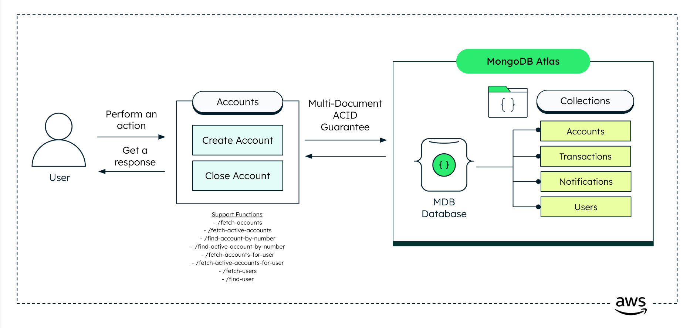
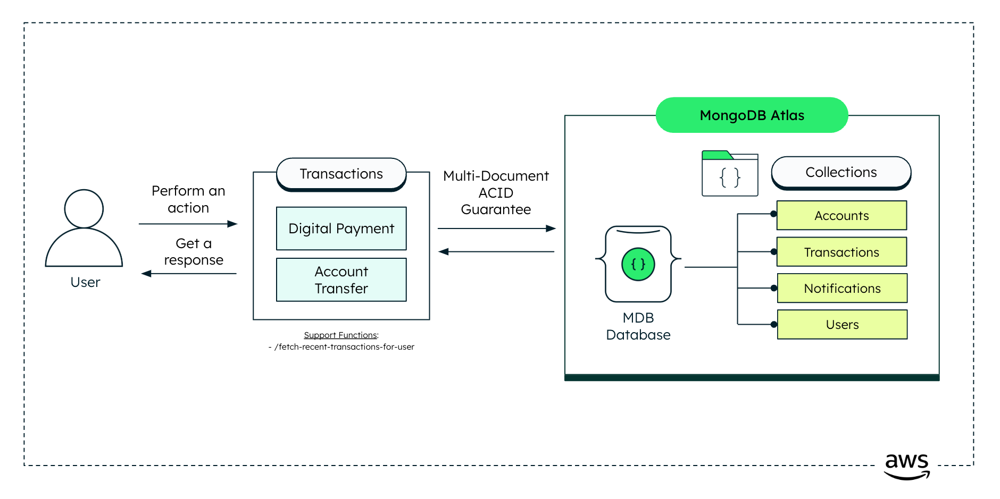

# Leafy Bank - Core Banking

**Leafy Bank is the graphical user interface (GUI) for our demo banking application**, showcasing the integration of MongoDB's powerful features tailored specifically for [Financial Services](https://www.mongodb.com/solutions/industries/financial-services). This responsive and intuitive UI allows users to interact with a fully functional demo banking environment, highlighting advanced capabilities like real-time data processing, secure financial transactions, and a seamless user experience. It is designed to demonstrate the potential of building modern, customer-focused financial applications with MongoDB as the backbone.

## What This Demo Shows

Leafy Bank is a **BIAN v14-aligned** core-banking reference built as three FastAPI microservices over a single MongoDB Atlas database (`leafy_bank_bian`), fronted by a Next.js + LeafyGreen UI. Every backend endpoint follows BIAN Service Domain naming and a verb-in-URL contract; the UI talks to them through a path-segment-routed proxy.

### BIAN Service Domains implemented

| Service                       | BIAN Service Domain                                                            | Responsibility                                               |
| ----------------------------- | ------------------------------------------------------------------------------ | ------------------------------------------------------------ |
| **accounts** (8001)     | `PartyReferenceDataDirectoryEntry`, `CurrentAccountFulfillmentArrangement` | Customers + KYC, account lifecycle, source-of-truth balances |
| **transactions** (8002) | `PaymentOrderInitiation`                                                     | Payments/transfers as one multi-doc ACID settlement          |
| **ledger** (8003)       | `FinancialAccounting` / `FinancialBookingLog`                              | Async double-entry general-ledger pipeline                   |

### The two-phase money flow

1. **Synchronous settlement** — a payment is one MongoDB **ACID transaction**: `$inc` debtor down, `$inc` creditor up, insert the transaction, flip the payment to SETTLED, write the sender notification. Idempotent via an `Idempotency-Key` header.
2. **Asynchronous general ledger** — **change-stream** workers react to settled transactions with no polling: `transactions → ledgerEvents → subLedgerEntries`, then a periodic batch rolls them into balanced `journalEntries` (debits == credits enforced at the DB level). The UI traces a payment through all stages live via `/pipeline/trace/{paymentId}`.

### MongoDB collections (`leafy_bank_bian`)

| Collection           | Backs BIAN object                    | Notes                                                          |
| -------------------- | ------------------------------------ | -------------------------------------------------------------- |
| `customers`        | PartyReferenceDataDirectoryEntry     | Customer master + nested KYC                                   |
| `accounts`         | CurrentAccountFulfillmentArrangement | Source-of-truth balances                                       |
| `payments`         | PaymentOrderInitiation               | Payment orders, status PENDING → SETTLED                      |
| `transactions`     | —                                   | Settled payment legs (business fact, no GL legs)               |
| `notifications`    | —                                   | Sender-side notifications                                      |
| `ledgerEvents`     | FinancialBookingLog                  | Stage ①: debit + credit legs, postingStatus PENDING → POSTED |
| `subLedgerEntries` | FinancialAccounting                  | Stage ②: two entries per event (DR + CR)                      |
| `journalEntries`   | FinancialAccounting                  | Stage ③: batched, balanced (Pacioli enforced)                 |
| `glAccounts`       | FinancialAccounting                  | Chart of accounts                                              |

## Where Does MongoDB Shine?

Leafy Bank demonstrates the power and flexibility of MongoDB, making it an ideal choice for financial services applications. By leveraging MongoDB’s advanced features, the backend microservices are designed to handle complex banking operations efficiently and securely.

This modern **microservices architecture** splits functionalities across different repositories, showcasing a real-world approach to scalable and maintainable software development. Here's how MongoDB shines in the backend services powering Leafy Bank:

### 1. **Accounts Service**

**[Accounts Service](backend/accounts/)**
This service handles account operations. MongoDB excels here by offering a **flexible schema**, allowing the system to adapt to evolving account data structures without requiring disruptive migrations. Its scalability and adaptability ensure real-time updates and a seamless account management experience.



---

### 2. **Transactions Service**

**[Transactions Service](backend/transactions/)**
Responsible for handling digital payments and account-to-account transfers, this service uses MongoDB’s **multi-document ACID transactions** to ensure reliable and consistent financial operations. This guarantees the integrity and correctness of data across multiple collections, making MongoDB a trusted choice for critical workflows within banking systems.



---

### 3. **Ledger Service**

**[Ledger Service](backend/ledger/)**
Powers the asynchronous general-ledger pipeline behind every payment. MongoDB **change streams** let this service react to settled transactions in real time — without polling — feeding an event-driven flow that projects double-entry sub-ledger entries and rolls them up into journal entries. Combined with **multi-document ACID transactions** to keep debits and credits balanced and **aggregation pipelines** for periodic batch posting, MongoDB delivers the consistency and event-driven processing that core accounting systems demand.

---

By adopting a **microservices architecture**, Leafy Bank splits features across multiple repositories. This design not only supports **scalability**, **modular development**, and **independent deployments** but also underscores MongoDB’s versatility in driving dynamic and robust systems.

This approach reflects a **modern and practical way to develop software**, supporting the scalability, modularity, and maintainability required for financial services in today’s fast-evolving world.

## Tech Stack

- **[MongoDB Atlas](https://www.mongodb.com/atlas)** — operational data layer. Uses ACID multi-document transactions, change streams, JSON Schema validators, and aggregation pipelines. **A replica set is required** (change streams and multi-doc transactions do not work on a standalone server).
- **[FastAPI](https://fastapi.tiangolo.com/)** (Python `>=3.10,<3.11`, [Poetry](https://python-poetry.org/)-managed) — the three backend microservices.
- **[PyMongo](https://pymongo.readthedocs.io/)** — synchronous MongoDB driver.
- **[Next.js 15](https://nextjs.org/)** App Router + **[React 19](https://react.dev/)** — the frontend (JavaScript, not TypeScript).
- **[LeafyGreen UI](https://github.com/mongodb/leafygreen-ui)** (MongoDB's design system) + **[CSS Modules](https://github.com/css-modules/css-modules)** — component-scoped styling.
- **[Docker](https://www.docker.com/)** + **[Drone CI](https://www.drone.io/)** → **Kanopy** (MongoDB internal Kubernetes) — build and deploy.

## Prerequisites

Before you begin, ensure you have the following:

- **Python** `>=3.10,<3.11` and **[Poetry](https://python-poetry.org/docs/#installation)** — for the backend services.
- **Node.js** (LTS) and **npm** — for the frontend and the BIAN data-model explorer.
- **[MongoDB Atlas](https://www.mongodb.com/atlas)** cluster, or any **replica-set** deployment. A standalone `mongod` will not work — change streams and multi-document transactions both require a replica set.
- **Docker & Docker Compose** (optional, for containerized runs).

### Seed Data

Sample data ships in `backend/data/sample/`. Import each file into the `leafy_bank_bian` database with [MongoDB Compass](https://www.mongodb.com/products/tools/compass) or `mongoimport`:

| File                                  | Collection       |
| ------------------------------------- | ---------------- |
| `leafy_bank_bian.customers.json`    | `customers`    |
| `leafy_bank_bian.accounts.json`     | `accounts`     |
| `leafy_bank_bian.transactions.json` | `transactions` |
| `leafy_bank_bian.glAccounts.json`   | `glAccounts`   |

> **_Note:_** The pipeline collections — `payments`, `ledgerEvents`, `subLedgerEntries`, `journalEntries`, `notifications` — are created at runtime as payments flow through. No seed needed.

### Environment variables

Each backend service reads its config from a `.env` in its own directory. Create one per service using the template below.

**`backend/accounts/.env`**, **`backend/transactions/.env`**, **`backend/ledger/.env`:**

```bash
MONGODB_URI=                       # required — your replica-set / Atlas connection string
LEAFYBANK_DB_NAME=leafy_bank_bian  # optional, this is the default

# transactions only:
PAYMENT_LIMIT_USD=500              # optional, per-payment ceiling (default 500)

# ledger only:
GL_BATCH_INTERVAL_SECONDS=600      # optional, GL batch cadence (default 600)
ENABLE_CHANGE_STREAMS=true         # optional (default true)
```

**Frontend** — create `frontend/.env.local`. The UI proxies BIAN requests to each service by path segment, so it needs the backend URLs:

```bash
ACCOUNTS_BACKEND_URL="http://localhost:8001"
TRANSACTIONS_BACKEND_URL="http://localhost:8002"
LEDGER_BACKEND_URL="http://localhost:8003"
# Optional: external open-finance aggregation (out of scope for the BIAN flow)
CORE_BACKEND_URL="http://localhost:8000"
```

### Services and ports

| Service      | Port | Notes                                                                               |
| ------------ | ---- | ----------------------------------------------------------------------------------- |
| accounts     | 8001 | BIAN`PartyReferenceDataDirectoryEntry` + `CurrentAccountFulfillmentArrangement` |
| transactions | 8002 | BIAN`PaymentOrderInitiation` (synchronous ACID settlement)                        |
| ledger       | 8003 | BIAN`FinancialAccounting` + `/pipeline` monitor routes                          |
| bian-model   | 8004 | BIAN data-model explorer (Next.js), linked from the NavBar                          |
| frontend     | 3000 | Next.js UI                                                                          |

> The optional [Open Finance Service](https://github.com/mongodb-industry-solutions/leafy-bank-backend-openfinance) (external-bank aggregation) is out of scope for the BIAN flow; the proxy falls back to `CORE_BACKEND_URL` for its routes.

## Run it Locally

All commands run from the repository root via the `makefile`.

### First-time setup

Install dependencies for every service (backends via Poetry, frontends via npm):

```bash
make setup
```

### Start everything

```bash
make dev
```

This frees the dev ports, then starts the accounts, transactions, and ledger backends plus the frontend together. Open [http://localhost:3000](http://localhost:3000).

You can also run pieces individually:

```bash
make dev-accounts      # accounts backend (8001)
make dev-transactions  # transactions backend (8002)
make dev-ledger        # ledger backend (8003)
make dev-bian-model    # BIAN data-model explorer (8004)
make dev-frontend      # frontend (3000)
make kill-ports        # free the dev ports if they are stuck
```

## Run with Docker

From the repository root:

```bash
make build   # build and start all containers
make logs     # tail container logs
make clean   # stop and remove containers and images
```

Other lifecycle targets: `make up`, `make start`, `make stop`, `make down`.

## Common Errors

### Backend

- **`payments`/`ledgerEvents` never appear, or transactions hang** — your MongoDB is a standalone, not a replica set. Change streams and multi-document transactions require a replica set (use Atlas or `mongod --replSet`).
- **Service won't start** — check that the service's `.env` exists and `MONGODB_URI` is set and reachable.
- **Ledger pipeline not advancing** — confirm `ENABLE_CHANGE_STREAMS=true` and that the GL batch interval (`GL_BATCH_INTERVAL_SECONDS`) has elapsed.

### Frontend

- **API calls 404 / hit the wrong service** — check `frontend/.env.local`; the `*_BACKEND_URL` values must point at your running backends.
- **LeafyGreen UI components fail to load** — delete `node_modules` and reinstall with `npm install --legacy-peer-deps`.

## Additional Resources

- [MongoDB for Financial Services](https://www.mongodb.com/solutions/industries/financial-services)
- [Change Streams](https://www.mongodb.com/docs/manual/changeStreams/) — the engine behind the async GL pipeline
- [Transactions](https://www.mongodb.com/docs/manual/core/transactions/) — multi-document ACID settlement
- [Aggregation Pipelines](https://www.mongodb.com/docs/manual/aggregation/) — GL batch posting
- [BIAN](https://bian.org/) — the banking service-domain reference model this demo aligns to
- [FastAPI](https://fastapi.tiangolo.com/) · [Next.js 15](https://nextjs.org/) · [LeafyGreen UI](https://github.com/mongodb/leafygreen-ui)

## 📄 License

See [LICENSE](LICENSE) file for details.
